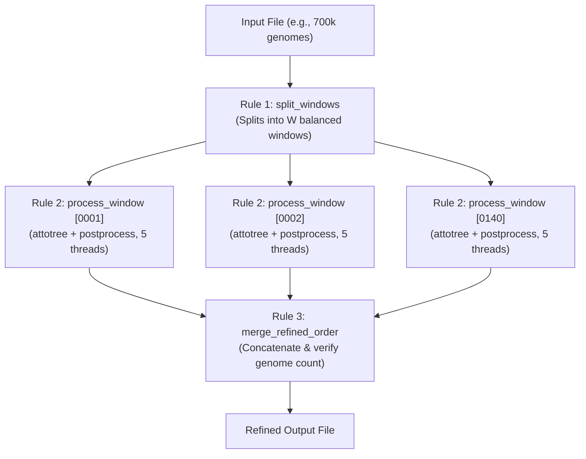

# Simple Snakemake Refinement Pipeline

A simple, 3-rule Snakemake pipeline designed for large collections (e.g., 700k genomes) with automatic thread scaling and strict error handling.

## Pipeline Design



- **No checkpoints / dynamic DAG**: Window count $W = \lceil N / \text{window\_size} \rceil$ is calculated upfront. The DAG is 100% transparent and deterministic before execution starts.
- **Automatic scaling**: Each window claims a fixed number of threads (default: `5`). When running with `--cores 90`, Snakemake automatically scales to $90 / 5 = 18$ concurrent jobs. Setting `--config threads_per_job=2` automatically scales to $90 / 2 = 45$ concurrent jobs.

## Fallback & Error Handling

1. **Automatic Bypass on Small Inputs (`min_size` or $< 4$)**:
   - If total genomes in the input $< \text{min\_size}$ (default: 10,000) or $< 4$, refinement is automatically skipped.
   - The file is copied directly to the output path without running attotree, logged to `results/logs/bypass_refinement.log`.
2. **Pre-flight input validation**:
   - Aborts immediately if the input file does not exist.
   - Aborts immediately if `window_size < 4`.
3. **Per-window logs**:
   - Every window logs its stdout and stderr to `results/logs/window_{batch_id}.log`.
   - If an attotree job fails, its log contains the exact error, and other independent windows can continue with `--keep-going`.
4. **End-to-end integrity check**:
   - Before completing, `merge_refined_order` verifies that each window's leaf file exists and is non-empty.
   - Verifies that the total number of lines in the final merged file equals the input genome count.
   - If a mismatch is detected, the corrupted output file is automatically deleted and an error is raised.

## Configuration

Edit [`workflow/config.yaml`](file:///Users/ktruong/tools/PhyloPack/workflow/config.yaml) or pass overrides via `--config`:

```yaml
input: "tests/data/genomes.txt"
output: "results/refined_order.txt"
window_size: 5000       # 5000 genomes per window
min_size: 10000         # If < min_size or < 4, copies directly and skips refinement
threads_per_job: 5      # Threads assigned to each attotree job
work_dir: "results"
```

## Running the Pipeline

### 1. Dry run (inspect job distribution before executing)

```bash
snakemake -s workflow/Snakefile --config input=700k_genomes.txt output=700k_refined.txt -n
```

### 2. Multi-core server (e.g., 90 cores, 5 threads per job -> 18 parallel jobs)

```bash
snakemake -s workflow/Snakefile \
    --cores 90 \
    --config input=700k_genomes.txt output=700k_refined.txt threads_per_job=5
```

### 3. Scaling to 45 parallel jobs (2 threads per job)

```bash
snakemake -s workflow/Snakefile \
    --cores 90 \
    --config input=700k_genomes.txt output=700k_refined.txt threads_per_job=2
```

### 4. Slurm Cluster

```bash
snakemake -s workflow/Snakefile \
    --jobs 50 \
    --cluster "sbatch --cpus-per-task={threads} --mem=8G --time=02:00:00 -p standard" \
    --config input=700k_genomes.txt output=700k_refined.txt
```
